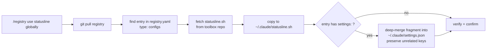

---
# Append-only metadata. Every field except `created` is a list that is ONLY appended to.
title: Distribute output styles and statusline via the registry
created: 2026-08-05T00:00:00-04:00
modified: [2026-08-05T00:00:00-04:00, 2026-08-05T22:17:42-04:00]
context: []          # no CONTEXT.md in this repo yet; plan uses plain language
commits: []
agents: [claude-fable-5]
sessions: [8570c44d]
back_refs: []
forward_refs: []
---

# Plan: Distribute output styles and statusline via the registry

## Purpose

Extend the registry so it can catalog and distribute two new kinds of assets across machines:

1. **Output styles** — single markdown files installed to `~/.claude/output-styles/` (first entry: `skippy.md`).
2. **Config files** — single dotfiles installed to `~/.claude/` (first entry: `statusline.sh`), whose activation requires a `settings.json` fragment.

Both are backed by the `orakitine/toolbox` repo as the source of truth, and both install with a single `/registry use <name>` on any machine — including the `settings.json` wiring, via a new generic `settings:` merge field on catalog entries.

> **Definition of Done:** this plan is complete when every box below is `[x]` and the global Validation Commands pass. The Purpose + those commands are the fixed goal — changing them requires an Amendments entry.

## Problem

The registry (this repo, deployed at `~/.claude/skills/registry`) distributes three asset types — skills, agents, prompts — as pointers into source repos. Two more asset kinds currently live **only** on one machine, undistributable:

- `~/.claude/output-styles/skippy.md` — the Skippy output style. Structurally identical to an agent/prompt (a single `.md` file), but the registry has no type for it, and activating it needs `"outputStyle": "Skippy"` in `~/.claude/settings.json`.
- `~/.claude/statusline.sh` — a 249-line status line script (prefers `jq`, falls back to `python3`; no network calls). It is wired up by a `settings.json` fragment that today hardcodes `/Users/olegrakitine/...`, which breaks on any machine with a different username.

Setting up a new machine means manually copying both files and hand-editing `settings.json`. The registry exists precisely to eliminate this, but its type system and recipes don't know these assets exist, and no asset type today can express "also merge this into settings.json".

## Solution

Three moves, smallest possible generalization:

1. **Toolbox becomes the source of truth.** Copy the two assets into `orakitine/toolbox` as `output-styles/skippy.md` and `statusline/statusline.sh`, alongside the existing `skills/`, `agents/`, `prompts/` directories.
2. **Two new single-file asset types** in the registry, mirroring how agents/prompts already work:
   - `output-styles` — default dir `.claude/output-styles/`, global `~/.claude/output-styles/`; typed ref `output-style:<name>`.
   - `configs` — default dir `.claude/`, global `~/.claude/`; typed ref `config:<name>`. Files keep their own basename (`statusline.sh` stays `statusline.sh`, not `<name>.md>`). Generic on purpose: future entries like `keybindings.json` slot in with zero schema work.
3. **A generic optional `settings:` field** on any catalog entry — a YAML map that the `use` workflow deep-merges into the target `settings.json` (`~/.claude/settings.json` for global installs, `.claude/settings.json` for project installs) after copying the file. Entry keys win; all other keys are preserved; the merge is idempotent; changed keys are reported to the user. This one mechanism handles both statusline wiring (`statusLine: {type: command, command: "bash ~/.claude/statusline.sh"}` — note the portable `~`) and output-style activation (`outputStyle: "Skippy"`).

The registry stays a **pure agent application**: the settings merge is a documented procedure in `references/source-formats.md` that the agent executes with Read/Edit — no scripts, no new dependencies.

## Relevant Files

### Existing Files

- `~/Documents/personal/toolbox/` — source-of-truth repo; gains `output-styles/` and `statusline/` directories
- `~/Documents/personal/toolbox/README.md` — repo overview; mention the two new directories
- `registry.yaml` — `default_dirs` gains `output-styles` and `configs`; catalog gains `output-styles:` and `configs:` sections with the two first entries
- `SKILL.md` — description line and add/use examples extended to mention the new types
- `README.md` — catalog example, source-format table, typed-deps list, and command docs updated
- `references/source-formats.md` — fetch/push copy rules for the two new single-file types; typed refs `output-style:`/`config:`; new **Settings Merge Workflow** section
- `references/add.md` — type detection (`output-styles/` in path → output-style; "statusline"/"config" → config), section routing, optional `settings:` capture
- `references/use.md` — section enumeration; new step "Merge settings fragment" between Fetch and Verify
- `references/list.md`, `references/sync.md`, `references/search.md`, `references/remove.md`, `references/push.md` — extend the skills/agents/prompts enumeration to all five types
- `~/.claude/output-styles/skippy.md` — asset to copy into toolbox (machine copy, currently the only one)
- `~/.claude/statusline.sh` — asset to copy into toolbox (machine copy, currently the only one)
- `~/.claude/settings.json` — currently hardcodes `/Users/olegrakitine/.claude/statusline.sh`; dogfood install rewrites it via the merge to the portable `~` form
- `~/.claude/skills/registry/` — deployed clone of this repo; picks up changes via the `git pull` every recipe already runs first

### New Files

- `~/Documents/personal/toolbox/output-styles/skippy.md` — distributed copy of the Skippy output style
- `~/Documents/personal/toolbox/statusline/statusline.sh` — distributed copy of the status line script
- `docs/plans/distribute-output-styles-and-statusline.md` — this plan

## Implementation Phases

**IMPORTANT:** Execute every phase and task step by step, in order, top to bottom.

### `[x]` Phase 1: Toolbox — publish the assets

Copy the two machine-local assets into the toolbox repo so the registry has something to point at. Toolbox is the source of truth from this moment; `~/.claude/` copies become installed artifacts.

#### 1. Add assets to toolbox

- `[x]` Create `output-styles/` in toolbox; copy `~/.claude/output-styles/skippy.md` into it unchanged
- `[x]` Create `statusline/` in toolbox; copy `~/.claude/statusline.sh` into it unchanged (script already prefers `jq` with `python3` fallback — no edits needed)
- `[x]` Mention both directories in the toolbox `README.md` (one line each, matching its existing tone)
- `[x]` Commit and push toolbox (`main`, matching the repo's existing direct-commit convention)

#### 2. Testing Strategy

Behaviors to verify through the public interface:

- `[x]` The GitHub browser URLs `https://github.com/orakitine/toolbox/blob/main/output-styles/skippy.md` and `.../statusline/statusline.sh` resolve to the pushed files — verified by fetching each raw URL and diffing against the local `~/.claude/` originals

Shell validation for this phase:

- `[x]` `diff ~/.claude/output-styles/skippy.md ~/Documents/personal/toolbox/output-styles/skippy.md` — toolbox copy is byte-identical
- `[x]` `diff ~/.claude/statusline.sh ~/Documents/personal/toolbox/statusline/statusline.sh` — toolbox copy is byte-identical
- `[x]` `git -C ~/Documents/personal/toolbox status -sb | head -1` — shows `## main...origin/main` with no ahead/behind

🔁 **Do not exit this phase until every box above is checked.** If a command fails, fix the cause and re-run — loop until all pass.

### `[x]` Phase 2: Registry schema — types and catalog entries

Teach `registry.yaml` the two new types and register the first entry of each.

#### 1. Extend default_dirs

- `[x]` Add to `default_dirs`: `output-styles:` with `default: .claude/output-styles/` and `global: ~/.claude/output-styles/`
- `[x]` Add to `default_dirs`: `configs:` with `default: .claude/` and `global: ~/.claude/`

#### 2. Catalog the two entries

- `[x]` Add `registry.output-styles:` section with entry `skippy` — source `https://github.com/orakitine/toolbox/blob/main/output-styles/skippy.md`, description of the persona style, and `settings: {outputStyle: "Skippy"}`
- `[x]` Add `registry.configs:` section with entry `statusline` — source `https://github.com/orakitine/toolbox/blob/main/statusline/statusline.sh`, description noting model/dir/branch/context%/rate-limit display and the `jq`-preferred/`python3`-fallback dependency, and `settings: {statusLine: {type: "command", command: "bash ~/.claude/statusline.sh"}}` (the `~` form — the portability fix)

#### 3. Testing Strategy

Behaviors to verify through the public interface:

- `[x]` The two new entries carry `name`, `description`, `source`, `settings` and sit under their own `registry.output-styles:` / `registry.configs:` sections — verified by grep-based structural checks (NOT a strict YAML parser; see Notes — the existing catalog's unquoted `[skill:browser]` refs are not YAML-1.1-parseable, and the registry is read by the agent, not a parser)
- `[x]` No `settings:` value anywhere in the catalog contains the string `/Users/` — verified by grep (portability guard)

Shell validation for this phase:

- `[x]` `grep -qE '^  output-styles:' registry.yaml && grep -qE '^  configs:' registry.yaml && echo sections-ok` — both catalog sections exist (two-space indent = under `registry:`/`default_dirs:`)
- `[x]` `grep -q 'outputStyle: "Skippy"' registry.yaml && grep -q 'command: "bash ~/.claude/statusline.sh"' registry.yaml && echo settings-ok` — both settings fragments present, statusline in portable `~` form
- `[x]` `! grep -n '/Users/' registry.yaml` — no machine-specific paths in the catalog

🔁 **Do not exit this phase until every box above is checked.** If a command fails, fix the cause and re-run — loop until all pass.

### `[x]` Phase 3: Recipes — thread the types through every workflow

Update the SKILL.md router and all eight reference recipes so the new types are first-class everywhere an existing type is enumerated. The registry stays a pure agent application — the settings merge is a documented agent procedure, not a script.

#### 1. Shared procedures (source-formats.md)

- `[x]` Fetch Workflow: add copy rules for **Output styles** and **Configs** — copy just the file, preserving its basename (`cp <file> <target_directory>/<basename>`), for both local and GitHub sources
- `[x]` Push Workflow: state that single-file types (agents, prompts, output styles, configs) push the file, not a directory
- `[x]` Typed Dependencies: add `output-style:name` and `config:name`
- `[x]` New section **Settings Merge Workflow**: if an entry has `settings:`, after a successful fetch deep-merge the map into the target scope's `settings.json` (`~/.claude/settings.json` for global, `.claude/settings.json` for project) — entry keys win, all other keys preserved, create the file if absent, idempotent by construction, and report exactly which keys changed. Executed with Read/Edit, no scripts.

#### 2. Command recipes

- `[x]` `use.md` — extend section enumeration (step 2) and type-based target selection (step 4); insert new step between Fetch and Verify: "Merge settings fragment (if entry has `settings:`) per the Settings Merge Workflow"; extend Verify and Confirm to name the merged keys
- `[x]` `add.md` — type detection: path contains `output-styles/` → `output-style`; user says "config"/"statusline"/file is a dotfile going to `~/.claude/` → `config`; capture optional `settings:` when the user supplies activation wiring; extend the YAML placement comment and typed-ref examples
- `[x]` `list.md`, `sync.md`, `search.md`, `remove.md`, `push.md` — extend each recipe's skills/agents/prompts enumeration to all five sections (mechanical; `sync.md` must also re-run the settings merge on refresh)
- `[x]` `SKILL.md` — description frontmatter and Purpose line mention output styles and configs; add one `add` and one `use` example featuring the new types
- `[x]` `README.md` — catalog example gains the two sections and a `settings:` example; typed-deps list, command table, and "What It Is" blurb updated

#### 3. Skill-forge audit of the modified skill

The registry IS a skill, and this phase rewrites its brain (`SKILL.md` + all eight recipes). Before the phase exits, audit the result with `skill-forge` rather than trusting the author's own eyes.

- `[x]` Run `/skill-forge` in evaluate/audit mode against `~/Documents/personal/registry` (the registry skill itself: frontmatter, structure, naming, reference routing, agentskills.io conformance)
- `[x]` Triage findings: fix anything blocking or cheap; log deliberately-skipped findings (with reason) in this plan's Notes
- `[x]` Re-run the audit after fixes until no blocking findings remain

#### 4. Testing Strategy

Behaviors to verify through the public interface:

- `[x]` Every recipe that enumerates asset sections names all five — verified by `grep -L 'output-styles' references/*.md` returning only files that legitimately don't enumerate (expected: none of the eight)
- `[x]` The Settings Merge Workflow is reachable from `use.md` and `sync.md` by explicit reference — verified by grep for "Settings Merge" in both
- `[x]` The modified registry skill passes a `skill-forge` audit with no blocking findings — verified by the audit's own report (task 3 above)

Shell validation for this phase:

- `[x]` `grep -l 'output-style' references/add.md references/use.md references/list.md references/sync.md references/search.md references/remove.md references/push.md references/source-formats.md | wc -l` — prints `8`
- `[x]` `grep -c 'Settings Merge' references/source-formats.md references/use.md references/sync.md | grep -v ':0'` — merge procedure defined and referenced

🔁 **Do not exit this phase until every box above is checked.** If a command fails, fix the cause and re-run — loop until all pass.

### `[wip]` Phase 4: Dogfood — install both on this machine through the registry

Commit and push the registry changes, update the deployed clone, and run the real `use` flows end to end. This machine becomes the first consumer, which also fixes its hardcoded `/Users/olegrakitine` statusline path.

#### 1. Ship and deploy

- `[]` Commit registry changes (`registry.yaml`, `SKILL.md`, `README.md`, `references/`, this plan) and push to `main`
- `[]` `git -C ~/.claude/skills/registry pull` — deployed clone picks up the new recipes

#### 2. End-to-end install

- `[]` Snapshot `~/.claude/settings.json` to a temp backup for comparison
- `[]` Run the `use` workflow for `skippy` globally — file lands at `~/.claude/output-styles/skippy.md`, `outputStyle: "Skippy"` merged (already-set value → idempotent no-op, reported as unchanged)
- `[]` Run the `use` workflow for `statusline` globally — file lands at `~/.claude/statusline.sh`, `statusLine.command` becomes `bash ~/.claude/statusline.sh` (the portability fix applied to this machine)
- `[]` Diff settings.json against the backup: only `statusLine.command` changed; every unrelated key intact

#### 3. Testing Strategy

Behaviors to verify through the public interface:

- `[]` A `use` of an entry with `settings:` changes only that entry's keys in `settings.json` — verified by the before/after diff showing exactly one changed leaf
- `[]` The installed statusline script still renders a status line when fed sample stdin JSON — verified by piping a minimal Claude Code statusLine JSON object into `bash ~/.claude/statusline.sh` and checking non-empty single-line output
- `[]` Running the same `use` twice is idempotent — verified by a second run producing byte-identical `settings.json`

Shell validation for this phase:

- `[]` `diff ~/.claude/output-styles/skippy.md ~/Documents/personal/toolbox/output-styles/skippy.md` — installed copy matches source of truth
- `[]` `python3 -c "import json; d=json.load(open('$HOME/.claude/settings.json')); assert d['statusLine']['command']=='bash ~/.claude/statusline.sh'; assert d['outputStyle']=='Skippy'; print('ok')"` — merged wiring is the portable form
- `[]` `echo '{"model":{"display_name":"Test"},"workspace":{"current_dir":"'$HOME'"}}' | bash ~/.claude/statusline.sh | head -1 | grep -q . && echo renders` — script executes and prints

🔁 **Do not exit this phase until every box above is checked.** If a command fails, fix the cause and re-run — loop until all pass.

## Validation Commands

Run these to validate the entire plan is complete:

- `[]` `git -C ~/Documents/personal/toolbox status -sb | head -1 && git -C ~/Documents/personal/registry status -sb | head -1` — both repos pushed, neither ahead of origin
- `[]` `cd ~/Documents/personal/registry && [ "$(grep -cE '^  (output-styles|configs):' registry.yaml)" = "4" ] && echo schema-ok` — both new types present in BOTH `default_dirs` and `registry` (2 sections × 2 places = 4 hits)
- `[]` `! grep -rn '/Users/' ~/Documents/personal/registry/registry.yaml` — no machine-specific paths in the catalog
- `[]` `diff ~/.claude/output-styles/skippy.md ~/Documents/personal/toolbox/output-styles/skippy.md && diff ~/.claude/statusline.sh ~/Documents/personal/toolbox/statusline/statusline.sh` — installed artifacts match the source of truth
- `[]` `python3 -c "import json; d=json.load(open('$HOME/.claude/settings.json')); assert d['statusLine']['command']=='bash ~/.claude/statusline.sh'; print('ok')"` — this machine runs the distributed, portable wiring

🔁 **The plan is not complete until every box is checked and every command passes.** If a step is genuinely impossible, mark it `[f]`, record why in Notes, and move on.

## Notes

- **No CONTEXT.md** exists in this repo; the plan uses plain language. Running `setup-toolbox-context` would let future plans speak a shared domain vocabulary.
- **The catalog is agent-read, not parser-read** (discovered while authoring this plan): the existing `requires: [skill:browser, agent:browser-qa]` entries use unquoted `type:name` refs in flow sequences, which strict YAML-1.1 parsers (PyYAML, Ruby psych/libyaml) reject outright. That's fine — the registry is a pure agent application and the agent reads the file directly — but it means validation commands here must use grep-based structural checks, never `yaml.safe_load`. Do not "fix" the existing refs by quoting them as part of this plan; that's a separate cosmetic decision.
- **Why a generic `configs` type instead of a dedicated `statusline` type:** the registry's cost is in recipe enumeration, paid once per *type*, not per entry. `configs` absorbs future dotfiles (`keybindings.json`, hook scripts) for free; a `statusline` type would be a one-entry type.
- **Why `settings:` is a field, not a type:** activation-via-settings is orthogonal to asset kind — output styles need it too (`outputStyle`). One merge mechanism, declared per entry, keeps the type system about *where files go* and the field about *what turns them on*.
- **Merge semantics deliberately shallow-and-simple:** entry keys win at the leaf level, everything else preserved, no delete semantics. An entry that needs to *remove* a settings key is out of scope; none exists today.
- **Activation is automatic by design** for these two entries — pulling `skippy` and not activating it was judged the surprising behavior, since the entry declares its wiring. If a future entry should install passive, it simply omits `settings:`.
- **`sync` must re-merge:** a refreshed asset may ship changed wiring; `sync.md` re-running the merge keeps installed machines converged. Idempotency makes this safe.
- **Statusline script dependencies:** prefers `jq`, falls back to `python3`, no network calls — stock macOS works without Homebrew. Recorded in the catalog description so a fresh machine isn't surprised.
- **Deployment model recap:** edits happen in `~/Documents/personal/registry`, push to GitHub `main`; the deployed clone at `~/.claude/skills/registry` self-updates because every recipe starts with `git pull`.
- **Write ownership (swarm):** single-agent plan; one agent owns all plan writes.
- **This plan is transitory** (per Oleg): fine to delete after Definition of Done; the durable knowledge lands in README.md and the recipes.
- **Skill-forge audit (Phase 3 task 3): PASS, 0 blocking / 7 recommended / 6 nit.** Fixed during the phase: stale three-type enumerations in `install.md`, `CLAUDE.md`, and the justfile comments; SKILL.md description trigger words; statusline entry marked GLOBAL-install (its settings fragment points at `~/.claude/`); README justfile shortcut list completed. **Deliberately skipped (all pre-existing, none introduced by this plan):** reference→reference chaining into `source-formats.md` (mitigated by SKILL.md's router-level declaration; inlining would violate single-source-of-truth); `registry.yaml` alphabetical-sort drift in the skills/agents sections (data churn, separate cleanup); README.md duplicating procedure text owned by SKILL.md/references (repo landing page tradeoff); bare `git pull` in every recipe assuming cwd is the skill directory (real failure mode, worth its own pass across all nine recipes); `--model opus` hardcoded in the justfile (user's call); `AGENT.md` detection heuristic that never fires for the in-house convention; missing optional `license`/`metadata` frontmatter.

## Amendments

<!-- Append-only history of changes made AFTER the plan was first authored.
     Populated by update-plan and update-references; newest at the bottom.
     A change to Purpose or Definition of Done MUST be logged here with rationale. -->
- **2026-08-05T22:17:42-04:00 — Added skill-forge audit gate to Phase 3**: Oleg asked whether the plan double-checks the modified registry skill with skill-forge. It didn't. Phase 3 now has task 3 (audit `SKILL.md` + recipes with `/skill-forge`, triage, re-run until no blocking findings) and a matching Testing Strategy behavior; Testing Strategy renumbered to task 4. Path change only — Purpose and Definition of Done untouched.
